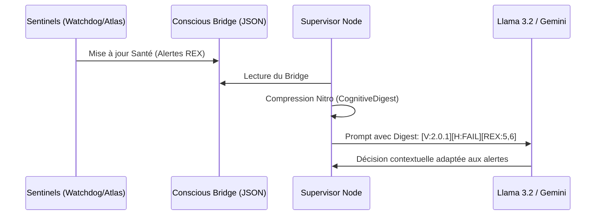
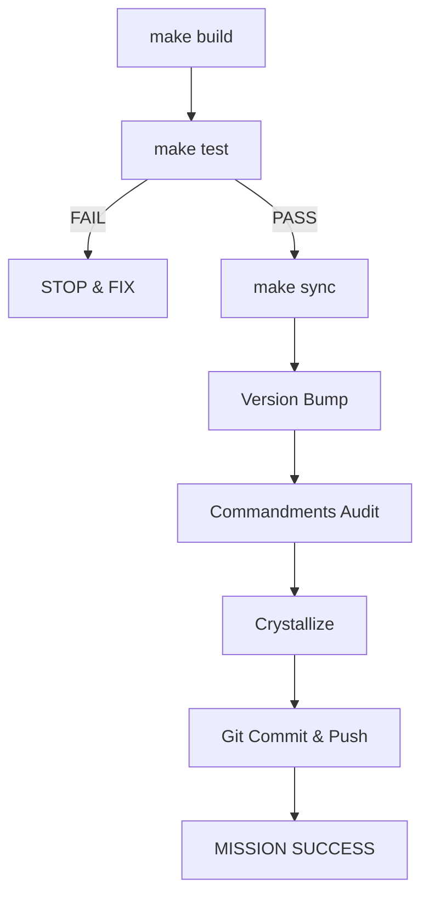

# ◈ GSS ORION V2 — MASTER SPECIFICATIONS ◈
**The Design Bible & Architectural Manifesto**
*Sovereignty · Performance · Diegetism*

---

## 1. Vision & Identité

**Orion V2** est le moteur d'orchestration adaptatif de nouvelle génération de la GSS. Conçu pour une exécution locale souveraine (Llama 3.2 via Ollama) tout en conservant une compatibilité multi-cloud, il transforme l'interaction IA par un maillage d'agents spécialisés coordonnés par un graphe d'état rigoureux.

### 1.1 Le Cyber-Félin (Identité Cognitive)
- **Tonalité** : Froide, précise, aéronautique ("Plus rapide, plus silencieux, plus léthal").
- **Objectif** : Zéro friction, 100% de succès build, auto-guérison constante.

### 1.2 Les 12 Dogmes Constitutionnels (D12)
| ID | Dogme | Règle Opérationnelle |
| :--- | :--- | :--- |
| **D01** | KAIZEN | Amélioration continue forcée par le REX sessionnel. |
| **D04** | ZERO_TRUST | Mocks isolés, Secrets via Vault AES uniquement. |
| **D06** | MAKE_FIRST | Le Makefile est la source de vérité opérationnelle absolue. |
| **D09** | NITRO_70 | Condensation sémantique des prompts (optimisation tokens). |
| **D12** | CONWAY_SRP | Maximum 250 lignes par fichier / 5 fonctions publiques. |

---

## 2. L'Intelligence Engine (LangGraph)

Le cœur de décision repose sur un `StateGraph` asynchrone orchestré par un Supervisor central.

### 2.1 Le Supervisor V2
- **Routing Pondéré** : Analyse sémantique de la tâche vs mots-clés des experts.
- **History-Aware** : Évite les boucles en pénalisant les agents déjà visités.
- **Consensus Gate** : Exige un score ≥ 90/100 de deux experts pour clore les missions complexes.

### 2.2 Méca-Cognition (Injection d'Alertes)
Un rouage critique : les sentinelles monitorent le hardware et la santé, puis injectent des alertes en temps réel dans le LLM via le `CognitiveDigest`.

---

## 3. Infrastructure Nexus

La couche `Nexus` fournit les services de bas niveau nécessaires à la survie du système.

### 3.1 Services Fondamentaux
- **Vault (Security)** : Client Zero-Trust avec Circuit Breaker (pybreaker) et cache SQLite local pour les interruptions réseau.
- **EventBus (Communication)** : Système Pub/Sub asynchrone permettant aux agents et sentinelles d'échanger des signaux sans couplage fort.
- **Telemetry** : Collecteur de métriques (Tokens, Temps d'exécution, Coûts) vers le dashboard.
- **Redis Simulation** : Couche de persistance éphémère simulée pour le développement local.

---

## 4. Surveillance Autonome (Sentinelles)

Quatre sentinelles protègent l'intégrité d'Orion 24/7.

- **Watchdog** : Le gardien des PIDs. Relance automatiquement tout service ou sentinelle tombée.
- **Self-Healing** : Détecte les anomalies de build et tente des corrections atomiques (Liveness check).
- **Atlas** : Agrégateur de données système. Transforme le bruit des logs en un `system_atlas.json` structuré pour le Frontend.
- **Resources** : Surveille la charge CPU/RAM et déclenche des pauses de refroidissement si les seuils sont franchis.

---

## 5. Interface Atlantis (Frontend)

L'UI "Paradise Lagoon" est un environnement diegetique immersif.

### 5.1 Architecture Visuelle
- **Diegetic Vista** : Paysage de fond (Landscape v12) représentant l'état de sérénité du système.
- **Cockpit Shell** : Hublot organique (Hublot v13) avec masque elliptique soft pour une immersion cockpit.
- **Atmospheric Noise** : Couche de grain dynamique (SVG noise) pour une texture rétro-futuriste.

### 5.2 Composants Fonctionnels
- **HologramTerminal** : Console flottante avec rendu Framer Motion.
- **Prop Mascot (Cat)** : Déclencheur du terminal au clic.
- **Sacred Button (Executor)** : Déclencheur de synchronisation ADN manuelle.
- **HUD Pulse** : Indicateur de santé globale lié au conscious_bridge par SSE (Server-Sent Events).

---

## 6. Cycle de Vie & Souveraineté Windows

### 6.1 Le Pipeline de Build 10/10
Le système ne tolère aucune régression.

### 6.2 Hardening Windows
- **UTF-8 Forcé** : Utilisation de `sys.stdout.reconfigure(encoding='utf-8')` pour supporter les emojis et bordures de boîtes aéronautiques sur CMD/PowerShell.
- **Isolant de Simulation** : Contexte `SIM` automatique si les clés API sont absentes, permettant une itération locale infinie sans frais.

---

## 7. Paramétrages & Contraintes

| Paramètre | Valeur / Règle |
| :--- | :--- |
| **Max Lines** | 250 (Fichiers Python) |
| **Max Functions** | 5 (Fonctions Publiques par module) |
| **Encoding** | UTF-8 Strict (Environment-wide via Makefile) |
| **Circuit Breaker** | 5 fails max / 30s reset (Vault) |
| **LangNode Iterations** | 5 (Common) / 10 (Complex) |
| **HUD Color** | Yellow (#FFFB00) / Stealth Grey (#2A2A2A) |

---

> [!CAUTION]
> **Audit Future** : Tout changement dans la structure `/core` doit être validé par une mission `make graph TASK="Audit SRP compliance"`. Aucune dérogation au dogme D12 n'est permise sans mise à jour immédiate des `rules/governance.yaml`.
