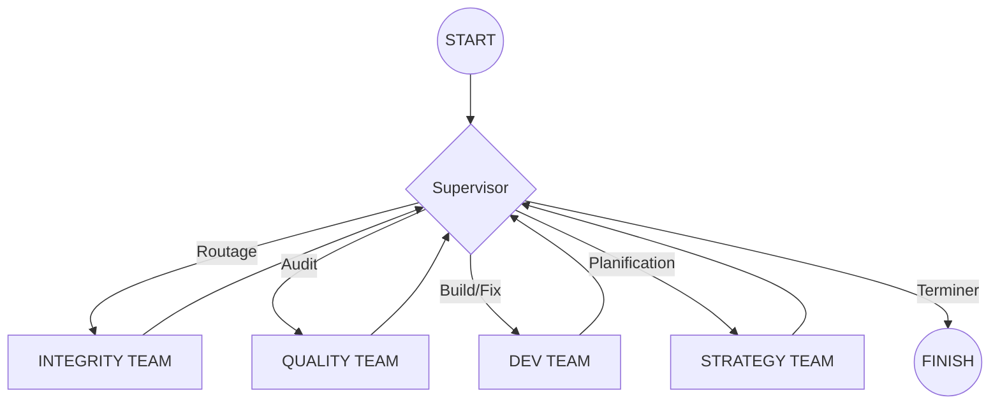

# Spécifications Techniques — GSS ORION V2
**Version Documentaire : 2.1.0 — Sovereign Core**

Ce document constitue le référentiel technique exhaustif du système **GSS Orion V2**. Il définit l'architecture, les modules, les flux de données et les règles de gouvernance du projet.

---

## 1. Vision & Fondations (D12 Dogmes)

L'architecture Orion V2 repose sur le **D12 (12 Dogmes Constitutionnels)**, garantissant la souveraineté et la stabilité du système.

| ID | Dogme | Description |
| :--- | :--- | :--- |
| **D01** | KAIZEN | Introspection et amélioration continue à chaque session. |
| **D04** | ZERO_TRUST | Sécurité par défaut via Vault et mocks isolés. |
| **D06** | MAKEFILE_FIRST | Le Makefile est la seule source de vérité opérationnelle. |
| **D09** | TOKEN_COMPACT | Optimisation sémantique à 100% pour l'efficience LLM. |
| **D12** | CONWAY_SRP | Single Responsibility Principle strict : < 250 lignes par fichier. |

---

## 2. Architecture des Dossiers

### 2.1 `/core` — Le Moteur de Souveraineté
Le cœur battant du système, gérant l'intelligence, l'infrastructure et la synchronisation.

- **`graph/`** : Orchestration LangGraph (Supervisor, Teams, State).
- **`nexus/`** : Services d'infrastructure (Vault, EventBus, Telemetry).
- **`sync/`** : Pipeline d'alignement ADN et cohérence multi-couches.
- **`llm_client.py`** : Gateway cognitive avec RAG-lite et Cognitive Digest.
- **`conscience.py`** : Singleton gérant l'état de conscience et les contraintes système.
- **`render.py`** : Moteur de rendu du `system.md` et du `MASTER_PLAN.md`.
- **`ui.py`** : Interface CLI aéronautique (UTF-8, Couleurs ANSI).

### 2.2 `/brain` — Mémoire et Identité
Le stockage persistant de l'intelligence et des principes.

- **`principles.json`** : Encodage des 12 dogmes.
- **`personality.json`** : Traits de caractère et tonalité d'Antigravity.
- **`adaptive_memory.json`** : Base de connaissances évolutive (REX/Apprentissage).
- **`conscious_bridge.json`** : Point de synchronisation inter-sessions (Version, Santé, Alertes).

### 2.3 `/.agents` — Doctrine Opérationnelle
- **`rules/system.md`** : La constitution immuable dictant le comportement de l'IA.

### 2.4 `/experts` — Registre et Modèles
- **`registry.yaml`** : Score et poids de chaque agent spécialisé.
- **`rules/`** : Définitions YAML/JSON des comportements par domaine (Strategy, Quality, etc.).
- **`templates/`** : Jinja2 templates pour les prompts système.

### 2.5 `/ops` — Gouvernance et Sentinelles
- **`sentinel_manager.py`** : Gestionnaire des processus de monitoring (Watchdog, Atlas).
- **`commandments_checker.py`** : Audit automatique de la conformité D12.
- **`tools/`** : Utilitaires de versioning, cristallisation et gestion mémoire.

### 2.6 `/portal` — Interface Atlantis
- **`frontend/`** : Dashboard React (Vite+Tailwind) - Thème Paradise Lagoon.
- **`backend/`** : API FastAPI assurant le pont entre le dashboard et le moteur LangGraph.

---

## 3. Flux & Comportements

### 3.1 Cycle d'Orchestration (LangGraph)
Le système utilise un graphe d'état cyclique dirigé par un **Supervisor**.

### 3.2 Processus de Cristallisation
À la fin de chaque mission, le système "cristallise" son état pour assurer la continuité.
1. Capture des scores d'experts.
2. Mise à jour du `conscious_bridge.json`.
3. Persistance de l'Atlas system.
4. Génération du `system.md` final (ADN).

---

## 4. API Opérationnelle (Makefile)

| Commande | Action | Comportement |
| :--- | :--- | :--- |
| `make boot` | **Preflight** | Test fondations + Audit D12 + Start Sentinelles. |
| `make sync` | **Alignment** | Alignement ADN entre code, bridge et principes. |
| `make status` | **Dashboard** | Audit de la mémoire et du registre des skills. |
| `make build` | **Sovereign** | Suite complète : Test -> Sync -> Bump -> Commit -> Push. |
| `make graph` | **Orchestrate** | Lance le graphe avec une `TASK` spécifique. |

---

## 5. Spécifications Nexus (Infra)

- **Vault** : Stockage sécurisé avec cache SQLite (`vault_cache.sqlite`) et Circuit Breaker.
- **EventBus** : Système de publication/abonnement asynchrone pour la communication inter-sentinelles.
- **Telemetry** : Suivi granulaire de la consommation de jetons et des sources LLM (Local vs Remote).
- **RAG-lite** : Injection dynamique d'expérience via recherche sémantique par mots-clés dans la mémoire adaptative.

---

> [!IMPORTANT]
> **Souveraineté Windows** : Toutes les commandes Python s'exécutent avec `PYTHONUTF8=1` pour garantir la stabilité de l'affichage des caractères aéronautiques sur PowerShell/CMD.
