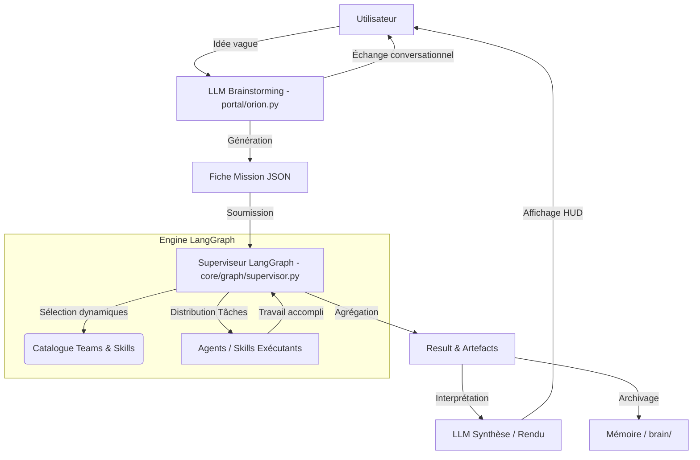

# Audit et Plan de Migration : GSS Orion (Usine à Projets)

Ce document répond aux exigences définies dans le `Cahier_des_charges_v4.txt` après une exploration approfondie de la base de code existante (Dossiers `core/graph/`, `portal/`, racine `.agents/skills`).

## 1. Diagnostic de l'existant

*   **Séparation des LLMs** : Partiellement inexistante. On trouve bien une route dédiée au chat dans `portal/backend/routers/orion.py` (LLM de Brainstorming), mais il n'y a pas de cloisonnement strict au niveau de la configuration ou des instances avec le "LLM de dev" et le "Superviseur". L'exécution de LangGraph se limite actuellement à un `router.py` rudimentaire par mots-clés (`core/graph/router.py`) plutôt qu'une véritable intelligence d'orchestration par agents.
*   **Pipeline LangGraph** : Le `compiler.py` actuel décrit un graphe basique (START → Supervisor → Teams statiques → END). Les équipes sont codées en dur (`INTEGRITY`, `QUALITY`, `STRATEGY`, `DEV`, `MAINTENANCE`) au lieu d'être composées dynamiquement en fonction d'une fiche mission.
*   **Interface (UI)** :
    *   L'application `App.jsx` dispose de la topologie "fenêtres" (HologramTerminal, TeamsWindow, MemoryDocsWindow, etc.), ce qui est un excellent point de départ.
    *   Le déclenchement d'une mission se fait via `handleExecute` (`/api/graph/run`), mais il n'y a pas de passage de "fiche mission" explicite générée par le brainstorm.
*   **Dossiers / Architecture** : Le dossier `.agents/skills/` à la racine contredit la règle R07/Architecture cible. Ces fichiers (qui définissent les agents) ne devraient pas polluer la racine ; ils appartiennent conceptuellement à `experts/` (règles) ou à `core/graph/teams` (si logique).

## 2. Architecture Cible

Pour transformer Orion en Usine à projets, l'architecture doit s'articuler avec un flux unidirectionnel de données :



L'Architecte (Moi) reste isolé et n'intervient jamais dans ce flux à l'exécution.

## 3. Liste des changements de code nécessaires

### Refactorisation Structurelle
*   **Déplacement des configurations Skills** : Migrer le contenu de `.agents/skills/` vers `experts/skills/` ou `brain/skills/` (selon que ce soit des templates yaml ou de la data JSON) pour respecter le Root Layout V3.
*   **Nettoyage du Routing** : Supprimer le routage probabiliste par Regex (`core/graph/router.py`) pour le remplacer par un **Supervisor LLM** capable de lire la fiche mission et d'appeler les bons *skills* dynamiquement via *tool calling*.

### Backend (`portal/backend/`)
*   Mettre à jour `routers/orion.py` : Le prompt de brainstorming doit formellement forcer la sortie d'un objet JSON de Mission (Cadrage structuré) à la fin de la discussion.
*   Mettre à jour `routers/graph.py` : L'endpoint de lancement (`/api/graph/run`) doit accepter l'objet Mission JSON en *payload* et le passer dans l'état initial (`GSSState`) de LangGraph.

### Graphe LangGraph (`core/graph/`)
*   **`state.py`** : Redéfinir le TypeDict global pour inclure `mission_spec`, `selected_teams`, `generated_artifacts` etc.
*   **`compiler.py`** : Remplacer les nœuds en dur par des "nœuds de compétence" dynamiques qui reçoivent le sous-ensemble de la mission à exécuter.

### Interface (`portal/frontend/`)
*   Modifier `HologramTerminal.jsx` pour inclure un "Validateur de Mission". Lorsque le chat déduit la mission, l'UI montre la fiche et demande confirmation avant de l'envoyer au Graph.
*   Actualiser `TeamsWindow.jsx` : L'affichage doit récupérer dynamiquement les définitions depuis le Backend (qui lit les fichiers migrés depuis `.agents/skills/`).

## 4. Modèle de données recommandé

Ces modèles dicteront la forme des interactions JSON entre le frontend, le brainstorming LLM et le backend.

```typescript
// 1. Mission (Générée par le LLM Brainstorming)
interface Mission {
  id: string; // ex: bsn_2026_01
  title: string;
  context: string;
  objectives: string[];
  constraints: string[];
  expected_deliverables: ("markdown" | "code" | "json")[];
}

// 2. Skill (Les capacités disponibles)
interface Skill {
  id: string; // ex: python_coder, markdown_synthesizer
  name: string;
  system_prompt: string;
  tools: string[]; // Noms des outils accessibles
}

// 3. Project Result (Issue du Superviseur)
interface ProjectResult {
  mission_id: string;
  status: "success" | "failed" | "partial";
  artifacts: {
    filename: string;
    content: string;
    type: "code" | "document";
  }[];
  summary: string;
  supervisor_feedback: string;
}
```

## 5. Flux d'exécution recommandé

1. **Phase d'Idéation** : L'utilisateur discute dans le HUD Chat. L'assistant (LLM Brainstorming) pose des questions obligatoires (`context`, `objectives`, `deliverables`).
2. **Cristallisation** : Le Chat génère la structure `Mission JSON` et l'interface la met en évidence (nouvelle fenêtre "Mission Draft").
3. **Approbation & Lancement** : L'utilisateur clique sur "Exécuter".
4. **Orchestration (LangGraph)** : 
    *   Node(Supervisor) : Lit la mission, consulte le pool `experts/skills`, détermine la liste des tâches et crée une équipe éphémère.
    *   Node(Worker) : Les skills exécutent les tâches.
    *   Node(Aggregator) : Collecte les résultats sous la structure `ProjectResult`.
5. **Rendu Visuel** : `portal/orion.py` lit le résultat, le synthétise, et l'UI affiche les documents générés dans `MemoryDocsWindow`.

## 6. Risques / Dette technique

*   **Dette "Router Regex"** : L'actuel routage par regex (`quality = 3, fix = 2`) risque de casser le flow intelligent du superviseur. C'est une dette urgente à supprimer au profit d'un Assistant router call (fonctionnalité Langchain Core).
*   **Risque de Hallucination du Superviseur** : Si la fiche mission n'est pas strictement encadrée en JSON Schema, le graphe va planter.

## 7. Plan de migration priorisé

> [!IMPORTANT]
> Les étapes doivent être prises en compte une par une pour ne pas invalider les tests de stabilité d'Orion.

- [ ] **Étape 1 : Nettoyage et Restructuration FS**
  - Migrer `.agents/skills/` vers le dossier approprié (ex: `experts/skills/`).
  - Lier ces ressources au Backend FastAPI pour qu'elles soient lisibles par REST GET `/api/skills`.
- [ ] **Étape 2 : API & Schémas JSON**
  - Mettre à jour `schemas/` du backend pour refléter le nouveau Modèle de Données (Mission, ProjectResult).
  - Brancher l'interface UI `TeamsWindow` pour afficher les Skills dynamiquement.
- [ ] **Étape 3 : Mise à jour du LLC Chat (Brainstorming)**
  - Modifier le *system prompt* de `routers/orion.py` pour forcer la clôture de brainstorm par l'émission de la `Mission JSON`.
- [ ] **Étape 4 : Refactor LangGraph (Le plus lourd)**
  - Débrancher le vieux routeur (`core/graph/router.py`).
  - Mettre le state `GSSState` à jour avec les propriétés liés à l'objet Mission.
  - Implémenter le Superviseur intelligent dans `compiler.py`.
- [ ] **Étape 5 : Refonte Front-end Finale**
  - Ajouter la vue de validation de Fiche Mission.
  - Ajouter l'ouverture d'un "Project Report" et la récupération des artefacts en temps réel via Socket ou Polling.

## 8. Recommandations concrètes pour le MVP

*   Ne codez pas de "tools" complexes pour les agents LangGraph dans un premier temps. Contentez-vous d'injecter du System Prompt et de laisser l'agent renvoyer une string markdown en fonction du prompt du skill.
*   Gardons 3 skills statiques dans le catalogue : "Rédacteur produit" / "Critique technique" / "Synthétiseur" pour prouver de bout en bout l'acheminement, plutôt que de configurer 8 skills d'un coup.

## 9. Questions restantes à clarifier

*   Les fichiers dans le dossier `.agents/skills` (ex: `brainstorming`, `captain`) sont-ils actuellement encodés en Markdown, JSON ou YAML ? (Cela dictera la façon de les migrer).
*   Dois-je supprimer les routes liées à la simulation V3 actuelle de "Teams Statiques", ou doit-on les garder en fallback au cas où le nouveau superviseur de l'UI est désactivé ?
*   Le dashboard affiche aujourd'hui `logHistory`. Faut-il implémenter des WebSockets pour le suivi "Live" du Superviseur lors de l'exécution d'un projet de longue durée pour l'UX ?
